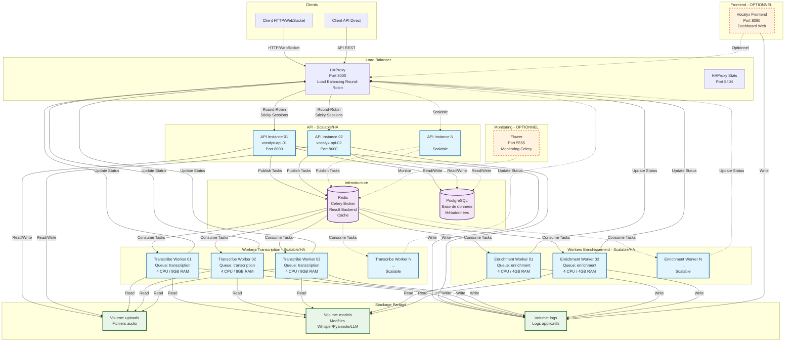

# Schéma de Déploiement - Vocalyx

## Architecture Microservices avec Haute Disponibilité



## Description des Composants

### 🔄 Load Balancer
- **HAProxy** : Point d'entrée unique (port 8000)
  - Load balancing Round-Robin entre instances API
  - Sticky sessions pour WebSocket
  - Health checks automatiques
  - Stats disponibles sur port 8404

### 🌐 Frontend (OPTIONNEL)
- **Vocalyx Frontend** : Interface web dashboard
  - Port 8080
  - Peut être désactivé si accès API direct uniquement
  - Communique avec l'API via HAProxy

### 🚀 API - Scalable / Haute Disponibilité
- **Instances multiples** : 2+ instances (actuellement 2)
  - Chaque instance : 1GB RAM
  - Load balancing via HAProxy
  - Partage la même base PostgreSQL
  - Sticky sessions pour WebSocket
  - **Scalable** : Ajouter des instances selon la charge

### 🎙️ Workers Transcription - Scalable / Haute Disponibilité
- **Instances multiples** : 3+ workers (actuellement 3)
  - Queue Celery : `transcription`
  - Chaque worker : 4 CPU / 8GB RAM
  - Traitement parallèle des fichiers audio
  - Utilise Whisper + Pyannote
  - **Scalable** : Ajouter des workers selon la charge

### ✨ Workers Enrichissement - Scalable / Haute Disponibilité
- **Instances multiples** : 2+ workers (actuellement 2)
  - Queue Celery : `enrichment`
  - Chaque worker : 4 CPU / 4GB RAM
  - Traitement LLM (Mistral, Phi-3)
  - **Scalable** : Ajouter des workers selon la charge

### 💾 Infrastructure
- **PostgreSQL** : Base de données relationnelle
  - Stockage des métadonnées (utilisateurs, projets, transcriptions)
  - Partagée par toutes les instances API
  
- **Redis** : Broker de messages et cache
  - Celery Broker (distribution des tâches)
  - Result Backend (résultats des tâches)
  - Cache applicatif

### 📊 Monitoring (OPTIONNEL)
- **Flower** : Interface de monitoring Celery
  - Port 5555
  - Visualisation des workers et tâches
  - Peut être désactivé en production

### 💿 Stockage Partagé
- **uploads/** : Fichiers audio uploadés
- **models/** : Modèles ML (Whisper, Pyannote, LLM)
- **logs/** : Logs applicatifs de tous les services

## Flux de Données

### 1. Upload et Transcription
```
Client → HAProxy → API Instance → Redis (Task)
                                    ↓
                            Transcribe Worker
                                    ↓
                            HAProxy → API Instance → PostgreSQL
```

### 2. Enrichissement
```
API Instance → Redis (Task)
                ↓
        Enrichment Worker
                ↓
        HAProxy → API Instance → PostgreSQL
```

### 3. WebSocket (Temps Réel)
```
Client → HAProxy (Sticky Session) → API Instance → WebSocket Manager
```

### 4. Frontend Dashboard
```
Frontend → HAProxy → API Instance → PostgreSQL
```

## Scalabilité

### API
- **Actuellement** : 2 instances
- **Scalable** : Ajouter `vocalyx-api-03`, `vocalyx-api-04`, etc.
- **HAProxy** : Détecte automatiquement les nouvelles instances (via health checks)

### Workers Transcription
- **Actuellement** : 3 workers
- **Scalable** : Ajouter `vocalyx-transcribe-04`, `vocalyx-transcribe-05`, etc.
- **Distribution** : Celery distribue automatiquement les tâches

### Workers Enrichissement
- **Actuellement** : 2 workers
- **Scalable** : Ajouter `vocalyx-enrichment-03`, `vocalyx-enrichment-04`, etc.
- **Distribution** : Celery distribue automatiquement les tâches

## Haute Disponibilité

- ✅ **API** : Plusieurs instances avec load balancing
- ✅ **Workers** : Plusieurs workers par queue (failover automatique)
- ✅ **PostgreSQL** : Peut être mis en cluster (recommandé en production)
- ✅ **Redis** : Peut être mis en cluster/sentinel (recommandé en production)
- ✅ **Health Checks** : Tous les services ont des health checks
- ✅ **Auto-restart** : Tous les conteneurs ont `restart: unless-stopped`

## Ports Exposés

| Service | Port | Description |
|---------|------|-------------|
| HAProxy | 8000 | API REST et WebSocket |
| HAProxy Stats | 8404 | Statistiques HAProxy |
| Frontend | 8080 | Dashboard web (optionnel) |
| PostgreSQL | 5432 | Base de données |
| Redis | 6379 | Broker Celery |
| Flower | 5555 | Monitoring Celery (optionnel) |

## Notes de Déploiement

1. **Frontend optionnel** : Peut être désactivé si accès API direct uniquement
2. **Scalabilité horizontale** : Tous les services applicatifs (API, Transcribe, Enrichment) sont conçus pour être multipliés
3. **Volumes partagés** : Les volumes `uploads`, `models`, et `logs` sont partagés entre tous les services
4. **Réseau** : Tous les services communiquent via le réseau Docker `vocalyx-network`
5. **Sécurité** : Utiliser `INTERNAL_API_KEY` pour les communications internes

